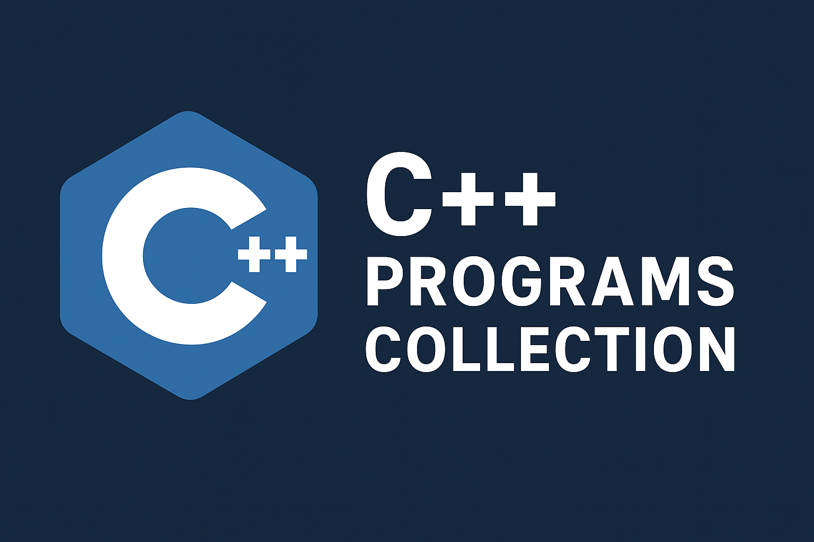

## C++ Programs Collection
Welcome to my **C++ Programs** repository!  
This is a curated collection of C++ programs that I’ve written, covering everything from basic syntax to advanced concepts.  
Whether you’re a beginner learning C++ or someone brushing up on core topics, this repo has something useful for you.



---

## What's Inside?

- **Fundamentals**  
  Simple programs to understand basic syntax, data types, and operators.

- **Object-Oriented Programming (OOP)**  
  Classes, inheritance, polymorphism, encapsulation, and more.

- **Data Structures & Algorithms (DSA)**  
  Linked lists, stacks, queues, trees, sorting, searching, and problem-solving codes.

- **Interesting Challenges**  
  Small projects, puzzles, logical challenges, fun simulation programs, and animation programs in C++.

---

## Why This Repository?

- **Learning Resource** – Perfect for students and enthusiasts practicing C++.
- **Reference Code** – Quickly find working examples of common algorithms.
- **Interview Prep** – Helpful for brushing up on core programming concepts.

---

## How to Use

1. Clone the repo:
   ```bash
   git clone https://github.com/garima342/Cplusplus_programs.git

   Open any .cpp file in your favorite editor (VS Code, CLion, etc.).

2. Compile & run:
3. g++ filename.cpp -o output
./output

## Contributions
Want to improve or add new programs?
Feel free to fork this repository, add your awesome code, and create a pull request.
Together, we can make this the ultimate C++ resource!

## Show Some Love
If you found this repository helpful, give it a star ⭐ on GitHub it motivates me to keep adding more quality content!

## Author
Garima Sethi
Email: garimasethi0022@gmail.com 

LinkedIn: https://www.linkedin.com/in/garima-sethi-4b7275280/
Let's connect! 
